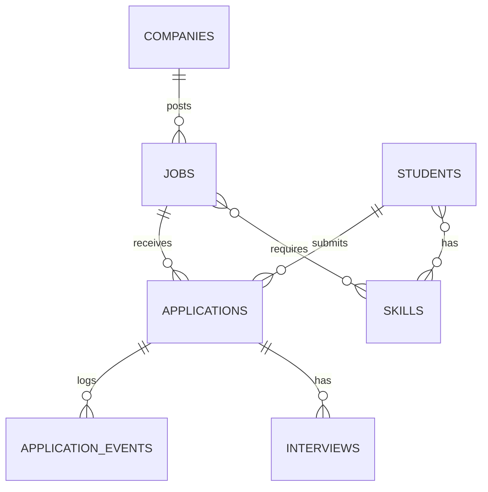

# PlaceMux — Data Model

**Database:** PostgreSQL 16
**Access:** Prisma ORM
**Migrations:** `prisma/migrations/`

## 1. Overview

Ten tables (plus Prisma's migration table) modelling the placement platform. Everything the mock served in Tasks 2–3 is now persisted, with the database itself enforcing the invariants the service layer used to police in code.

## 2. ER diagram



`STUDENTS }o--o{ SKILLS` and `JOBS }o--o{ SKILLS` are many-to-many, realised via `student_skills` and `job_skills` join tables (1NF — no comma-separated lists).

## 3. Tables

| Table | Purpose |
| --- | --- |
| `companies` | Employers |
| `jobs` | Job openings; `company_id` → companies (RESTRICT) |
| `students` | Candidates |
| `applications` | A student applied to a job (associative entity); unique on `(student_id, job_id)` |
| `application_events` | Append-only status-change audit trail |
| `interviews` | Scheduled rounds; unique on `(application_id, round)` |
| `skills` | Canonical skill names; unique |
| `student_skills` | M:N join, `level` 1–5 |
| `job_skills` | M:N join, `required` boolean |
| `_prisma_migrations` | Prisma's history table |

Column definitions live in [`prisma/schema.prisma`](../prisma/schema.prisma).

## 4. Keys

### Primary keys — `cuid`, exposed with type prefixes at the API boundary

Not `SERIAL` (leaks volume, guessable), not `UUID v4` (16 bytes, random order hurts index locality). `cuid` gives us global uniqueness, unguessability, and sortable-by-creation-time. See [ADR-0004](adr/0004-cuid-primary-keys.md).

### Foreign key ON DELETE choices

| FK | Behaviour | Why |
| --- | --- | --- |
| `jobs.company_id → companies` | `RESTRICT` | Deleting a company must not silently vaporise its job history |
| `applications.student_id → students` | `RESTRICT` | An application is a record of a real action |
| `applications.job_id → jobs` | `RESTRICT` | Same |
| `student_skills.student_id → students` | `CASCADE` | A skill link is meaningless without the student |
| `student_skills.skill_id → skills` | `CASCADE` | Same |
| `job_skills.job_id → jobs` | `CASCADE` | Same |
| `job_skills.skill_id → skills` | `CASCADE` | Same |
| `application_events.application_id → applications` | `CASCADE` | Events belong to their application |
| `interviews.application_id → applications` | `CASCADE` | Interviews belong to their application |

**Rule:** cascade only pure attachment/join rows; restrict anything a human would be upset to lose. See [ADR-0007](adr/0007-fk-restrict-by-default.md).

## 5. Constraints

Each rule the database enforces, and the bad-data scenario it prevents.

| Constraint | Prevents |
| --- | --- |
| `students.email UNIQUE` + `uq_students_email_lower` (partial, case-insensitive) | Two accounts on one email; `Aarav@x` colliding with `aarav@x` |
| `chk_students_email_format` | `foo` accepted as an email |
| `chk_students_cgpa` | A CGPA of 47 |
| `chk_students_grad_year` | A graduation year of 1066 |
| `chk_jobs_openings_positive` | A job posting with 0 openings |
| `chk_jobs_stipend_non_negative` | Negative stipends |
| `chk_jobs_deadline_after_creation` | A job that closed before it opened |
| `chk_companies_employee_count` | Zero or negative employee counts |
| `chk_interviews_round_positive` | Interview round 0 |
| `chk_student_skills_level` | Skill level of 11 |
| `chk_applications_withdrawn_consistency` (cross-column) | `status='UNDER_REVIEW'` with `withdrawn_at` set (or vice-versa) |
| `uq_application_student_job` (composite) | Applying twice to the same job |
| `uq_interview_application_round` (composite) | Two interviews claiming to be round 1 for the same application |
| FKs on every reference | Applications to jobs that don't exist |
| Enums for `StudentStatus`, `JobType`, `ApplicationStatus`, `InterviewOutcome` | A status of `'shortlissted'` |

**Why validate in both the API and the database?** The API's field-level validator gives users good error messages ("cgpa must be a number between 0 and 10"). The DB constraint is a *guarantee*: it defends the data against seed scripts, admin SQL sessions, future services, and analytics jobs — none of which pass through the API. Belt and braces.

Run `npm run db:constraints` to see all 11 constraints reject bad writes with the API entirely bypassed.

## 6. Indexes

Planned from real query patterns (see the Task 3 route map + `<module>.queryschema.js` files), not from intuition.

| Index | Query it serves |
| --- | --- |
| `students(status, graduation_year)` partial `WHERE deleted_at IS NULL` | List seeking students by grad year |
| `students(branch)` | Filter by branch |
| `jobs(company_id)` | Nested `/companies/:id/jobs` |
| `jobs(type, city)` | Filter jobs by type+city |
| `jobs(deadline)` | Sort/filter by deadline |
| `jobs(created_at DESC)` | Default "newest first" list |
| `jobs(city, type, deadline)` partial `WHERE deleted_at IS NULL AND is_open` | Hot path: live open roles in a city |
| `applications(job_id, status)` | Nested `/jobs/:id/applications` filtered |
| `applications(student_id, status)` | Nested `/students/:id/applications` filtered |
| `applications(applied_at DESC)` | Default sort |
| `application_events(application_id, created_at)` | Audit trail lookup |
| `interviews(application_id)` | Nested `/applications/:id/interviews` |
| `skills(name)` unique | Skill upsert |
| `applications.idempotency_key` unique | Task 2's idempotency-key replay check |
| `idx_jobs_title_trgm` (GIN, `pg_trgm`) | Fuzzy `LIKE '%term%'` on job titles |

**Composite column order:** equality columns first, then range/sort columns. `(city, type, deadline)` serves `WHERE city=? AND type=? AND deadline>?` but not `WHERE type=?` alone.

**Partial indexes** for the two things we filter on nearly every query — `deleted_at IS NULL` (soft-delete) and `is_open = true`. They cover half the table or less, so they're faster and smaller than full indexes.

## 7. Normalisation

### Worked example: the naive flat table

```
| app_id | student_name | student_email | student_branch | job_title | company_name | company_city | skills | status |
```

Anomalies:
- **Update:** Nimbus moves to Pune → three rows to update; miss one and the DB claims two cities
- **Insert:** A company with no jobs yet has nowhere to be recorded
- **Delete:** Deleting the last application for a student vaporises the student
- **Repeating group:** `skills` as a comma-separated string → `LIKE '%SQL%'` accidentally matches `NoSQL`

### Fixes applied

- **1NF** — `skills` split into `skills` + `student_skills` + `job_skills`; no arrays-in-cells
- **2NF** — no partial dependencies (only composite PKs are the join tables, and they hold no non-key data beyond the relationship attributes `level`/`required`)
- **3NF** — `company_city` is on `companies`, not on `jobs` or `applications`; `student_email` is on `students`

### Deliberate choices, not naïveté

- **`application_events` is intentionally append-only.** `applications.status` says where we are; `application_events` says how we got here. A mutable status column throws away the "who rejected them and when" answer forever.
- **No pre-computed counters (`companies.job_count`).** They avoid a `COUNT(*)` but drift out of sync. Deferred until measured to matter — a future ADR will justify adding one only when a real query proves it necessary.

## 8. Money & timestamps

- **`stipend_paise INTEGER`** — money as an integer in the smallest unit. Floating point can't represent `0.1` exactly (`0.1 + 0.2 !== 0.3`). Never store money as a float. See [ADR-0006](adr/0006-money-as-integer-paise.md).
- **`@db.Timestamptz(3)`** on every timestamp — timezone-aware with millisecond precision. `timestamp` (no zone) stores a wall-clock reading with no way to know which clock. Users span timezones; store UTC, format on the client.

## 9. Naming

- **Database:** `snake_case` table and column names
- **JavaScript:** `camelCase` model fields
- Bridged with Prisma's `@map` / `@@map`
- Table names are plural (`students`), model names are singular (`Student`)

## 10. Migrations

- Every schema change is a committed, versioned SQL file in `prisma/migrations/`
- **Applied migrations are immutable** — once merged, never edited; write a new migration instead
- `npm run db:migrate` — local (creates + applies)
- `npm run db:deploy` — CI/prod (applies pending only)
- `npm run db:reset` — local wipe + re-seed (**never** run in prod)

### Breaking change pattern: expand and contract

For a rename or type change, three deploys:

1. **Expand** — add the new column as nullable; both old and new code coexist
2. **Backfill + dual-write** — a migration copies data; the app writes both
3. **Contract** — once nothing reads the old column, drop it and make the new `NOT NULL`

Not needed in Phase 1 but written down so future us reaches for the pattern instead of a big-bang rename.

## 11. Seeding

```bash
npm run db:seed
```

Idempotent: every insert is `upsert`-guarded (or explicitly find-first-then-create for tables without a natural unique key). Running twice does not duplicate. Same principle as `Idempotency-Key` for `POST /applications`.

## 12. Swap point

`src/modules/<name>/<name>.repository.js` is a one-line dispatcher:

```js
module.exports = config.dataSource === 'postgres'
  ? require('./<name>.db.repository')
  : require('./<name>.mock.repository');
```

Set `DATA_SOURCE=postgres` in `.env` to use Postgres; `mock` reverts to in-memory. **Nothing above the repository line changed to go from Task 2 → Task 4.**

## 13. Decision records

- [ADR-0004: cuid primary keys](adr/0004-cuid-primary-keys.md)
- [ADR-0005: soft deletes with `deleted_at`](adr/0005-soft-deletes.md)
- [ADR-0006: money as integer paise](adr/0006-money-as-integer-paise.md)
- [ADR-0007: foreign-key RESTRICT by default](adr/0007-fk-restrict-by-default.md)
- [ADR-0008: append-only application events table](adr/0008-application-events-table.md)
