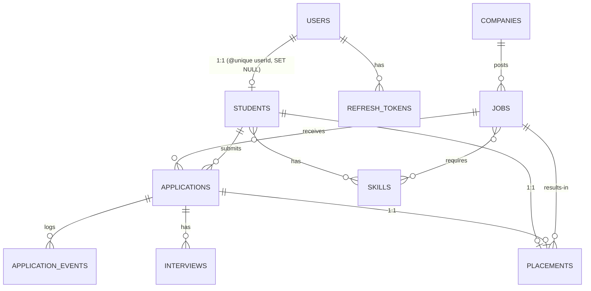

# PlaceMux — Data Relationships

## 1. Inventory

Every foreign key, with its cardinality and deliberate on-delete rule. Verified live by `node scripts/inspect-relationships.js` (which reads `information_schema` and fails if anything defaulted to `NO ACTION`).

| Parent | Child | Type | FK column | ON DELETE | Why |
| --- | --- | --- | --- | --- | --- |
| Company | Job | 1:N | `jobs.company_id` | **RESTRICT** | Deleting a company must not silently vaporise its job history |
| Job | Application | 1:N | `applications.job_id` | **RESTRICT** | An application is a record of a real action |
| Student | Application | 1:N | `applications.student_id` | **RESTRICT** | Same |
| Application | ApplicationEvent | 1:N | `application_events.application_id` | **CASCADE** | Events belong to their application |
| Application | Interview | 1:N | `interviews.application_id` | **CASCADE** | Interviews belong to their application |
| Student | StudentSkill | 1:N | `student_skills.student_id` | **CASCADE** | Skill link is meaningless without the student |
| Skill | StudentSkill | 1:N | `student_skills.skill_id` | **CASCADE** | Same |
| Job | JobSkill | 1:N | `job_skills.job_id` | **CASCADE** | Same |
| Skill | JobSkill | 1:N | `job_skills.skill_id` | **CASCADE** | Same |
| User | Student | 1:1 | `students.user_id` (`@unique`) | **SET NULL** | Preserve student record for audit even if the auth account is removed (ADR-0005 rationale) |
| User | RefreshToken | 1:N | `refresh_tokens.user_id` | **CASCADE** | Tokens have no meaning without their user |
| Student | Placement | 1:1 | `placements.student_id` (`@unique`) | **RESTRICT** | A placement is a historical fact; deleting a student must not silently erase it |
| Job | Placement | 1:0..N | `placements.job_id` | **RESTRICT** | Same |
| Application | Placement | 1:1 | `placements.application_id` (`@unique`) | **RESTRICT** | Same |

**Rule of thumb** (repeated from Tasks 4/7):
- **CASCADE** join/attachment rows.
- **RESTRICT** anything a human would be upset to lose.

## 2. ERD



## 3. Integrity guarantees

- Every FK has a deliberate ON DELETE rule (verified — see script output below)
- 1:1 enforced by `@unique` on the FK column, not just a plain FK
- Composite UNIQUE `(student_id, job_id)` on Applications — a student cannot apply twice
- Composite UNIQUE `(application_id, round)` on Interviews — no two round-1s per application

Verified via `scripts/inspect-relationships.js`:

```
✓ Every FK has a deliberate ON DELETE rule.
```

## 4. Placement — new resource (Task 8)

A placement is the outcome of an accepted offer: it says *this student got that job*. Modelled as its own table (not a status flag on the student) because it's a **genuine resource with a lifecycle**: it has its own timestamp, its own historical snapshot fields, and it links back to the specific application that produced it. See ADR-0021.

Two invariants live in the schema itself:

- `studentId @unique` — a student is placed at most once. The DB refuses a second placement.
- `applicationId @unique` — one placement per application; can't double-count.

### Snapshot fields — deliberate denormalisation

```
offeredCtcPaise BigInt
titleAtOffer    String
```

These are **copied** from the job at placement time, not looked up on read. If the job's package changes next year, the placement record of what was actually offered must not change with it. This is the "point-in-time snapshot" pattern from Task 4 (Part 3.6). See ADR-0022.

## 5. Seed data — deliberately messy (the sleeper deliverable)

A uniform seed hides relationship bugs. Ours deliberately contains the awkward shapes so bugs surface here, not in production. From `prisma/seed.js`, latest run:

```
━━ Seed summary ━━━━━━━━━━━━━━━━━━━━━━━━━━
  Companies:        6   (1 with no jobs)              ← empty-related-list
  Jobs:             12  (0 with no applications)
  Students:         15  (2 with no applications)      ← empty-related-list
  Applications:     40  (max per student: 10)         ← power applicant
  Applicants:       13
  Placements:       1                                 ← 1:1 exercised
━━━━━━━━━━━━━━━━━━━━━━━━━━━━━━━━━━━━━━━━━
```

Every count from that summary maps to a test scenario a lazy seed would miss:

| Shape | What it exposes |
| --- | --- |
| Students with 0 applications | Empty-array handling; `student.applications[0]` crashes |
| Company with 0 jobs | Empty related lists in nested reads |
| Power applicant (10 apps) | Nested-data pagination; N+1 |
| Placed student | The 1:1 placement path |
| Applications spanning every status | Every branch of the status state machine |

**Reproducible**: `faker.seed(42)` in `prisma/seed-src/helpers.js` — same data every run so tests and demos don't drift. See ADR-0023.

## 6. Efficient related queries

### `include` vs `select`

- **`include`** eagerly loads a relation — safe for small nested trees, but pulls the whole child object.
- **`select`** names exactly the fields you want — better for list views.

### `_count` and `take` — the tricks worth remembering

```js
prisma.student.findMany({
  select: {
    id: true, name: true,
    _count: { select: { applications: true } },  // just the count, not the rows
    applications: {
      take: 5,                                    // cap nested data
      orderBy: { appliedAt: 'desc' },
      select: { id: true, status: true },
    },
  },
})
```

`_count` avoids loading rows just to count them. `take` on a nested relation prevents the power applicant with 200 apps from dragging 200 rows into a list view.

### Aggregations via `groupBy`

```js
prisma.application.groupBy({
  by: ['status'],
  where: { jobId },
  _count: { _all: true },
})
```

Applications grouped by status for one job — one query, arithmetic done by Postgres. Pulling every row into Node and reducing in JS moves megabytes over the wire to compute a number the DB could return directly.

### Skill-matching — the worked relational example

`GET /api/v1/students/:id/recommended-jobs` — jobs whose required skills overlap with the student's, ranked by overlap count. Two queries, regardless of catalogue size:

1. `skill.repository.findIdsByNames(studentSkillNames)` — resolve skill IDs
2. `job.repository.findWithSkillOverlap(skillIds)` — `jobSkills: { some: { skillId: { in: skillIds } } }` — a many-to-many traversal in one bounded query

Ranking happens in memory, but only over the already-narrowed set of candidates.

## 7. N+1 policy — the assertion

**Rule**: query count must not grow with row count.

Enforced by `tests/n-plus-one.test.js`:

- Seed 5 students → measure query count for `listStudents`
- Seed 20 more (25 total) → measure again
- **The two counts must be equal** (± 1 for Prisma bookkeeping)

If someone refactors a service into a per-row loop, that test fails immediately and names the endpoint. That's the systematic detection the brief is asking for — not "we fixed the one we noticed" but "we can't regress without CI catching it".

Additional runtime warning: `src/shared/middleware/queryCounter.js` logs a `slow-query` line for any request that runs more than 10 queries. Cheap canary in dev.

## 8. Test matrix

| Suite | Proves |
| --- | --- |
| `relationships.test.js` — create failures | P2003 FK violation on application → nonexistent job / job → nonexistent company / placement → nonexistent application |
| `relationships.test.js` — cascade | Deleting an application removes its events; leaves student and job intact. Deleting a user removes refresh_tokens. |
| `relationships.test.js` — restrict | Can't delete a company with jobs / a job with applications / a student with applications |
| `relationships.test.js` — uniqueness | Can't apply twice to the same job (composite UNIQUE); can't place a student twice (1:1 `@unique`) |
| `n-plus-one.test.js` | `listStudents` query count is independent of row count; `recommendedForStudent` uses ≤ 8 queries regardless of match set size |

## 9. Decision records

- [ADR-0021: Placement as its own resource](adr/0021-placement-as-resource.md)
- [ADR-0022: Snapshot fields on Placement](adr/0022-snapshot-fields-on-placement.md)
- [ADR-0023: Deterministic seed via `faker.seed(42)`](adr/0023-faker-seed-pinned.md)
